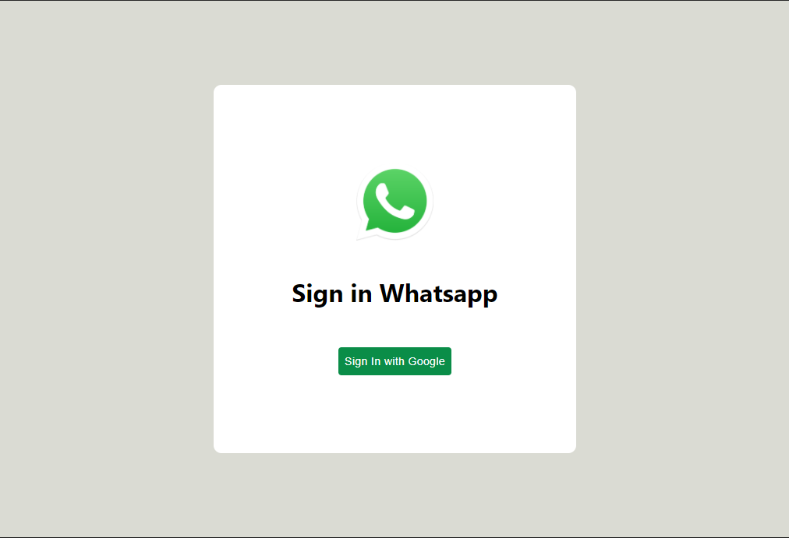
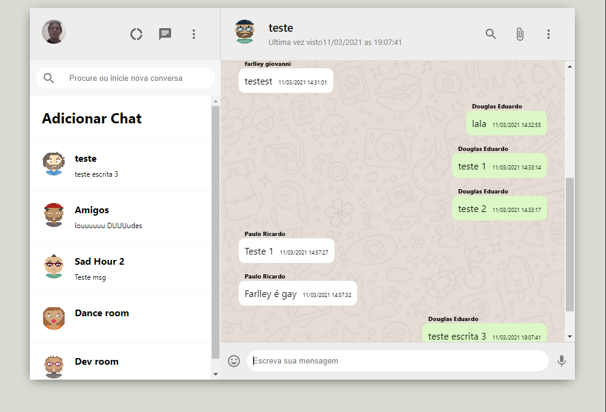

<h1 align="center">
  #Whatsapp Clone
</h1>

 <a href="#-imagens">Imagens</a>&nbsp;&nbsp;&nbsp;|&nbsp;&nbsp;&nbsp;
  <a href="#-tecnologias">Tecnologias</a>&nbsp;&nbsp;&nbsp;|&nbsp;&nbsp;&nbsp;
  <a href="#-projeto">Projeto</a>&nbsp;&nbsp;&nbsp;|&nbsp;&nbsp;&nbsp;
  <a href="#-como-executar">Como executar</a>

 
 

 

## 💻 Imagens

  

 

  

## ✨ Tecnologias

Esse projeto foi desenvolvido com as seguintes tecnologias:

- [React](https://reactjs.org)
- [TypeScript](https://www.typescriptlang.org/)
- [FireBase](https://firebase.google.com/)

## 💻 Projeto

Projeto de um clone do whatsapp feito para estudo. Utilizando a autentificação do google para logar.

## 🚀 Como executar

- Clone o repositório
- Instale as dependências com `npm install`
- Inicie o servidor com `npm start`

Agora você pode acessar [`localhost:3000`](http://localhost:3000) do seu navegador.

Feito por Douglas no NLW04 da Rocketseat ♥ 👋🏻
